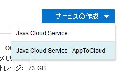
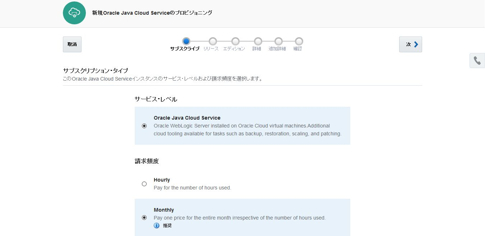

# Oracle Java Cloud Service - AppToCloud
---
## 説明

**Java Cloud Service - AppToCloud** は、オンプレミス環境に構築済みの既存 WebLogic ドメインの構成情報とアプリケーションをエクスポートし、Java Cloud Service 上に同じリソース、そして同じアプリケーションを持つインスタンスをプロビジョニングする仕組みです。

この AppToCloud 機能を使う事によって、オンプレミスからクラウドへの環境移行を素早く実施し、また単調かつ間違いの起こりがちなドメイン構成作業を回避する事が可能です。

- 参考: [SlideShare: AppToCloudによる オンプレミス既存環境のクラウド移行](http://www.slideshare.net/OracleMiddleJP/apptocloud)


## AppToCloud 実施前提

AppToCloud を利用して、オンプレミスの WebLogic ドメインを　Java Cloud Service へ移行するあたって、いくつかの前提条件があります。(*As of 2016.12月*)

主な条件に以下のような内容があります。

- オンプレミス環境を構築している WebLogic Server のバージョン
  - 10.3.3 以降 [11g, 12cRelease1, 12c Release2]
- WebLogic ドメインの全て起動していること
- WebLogic ドメインの構成にロックがかかっていないこと
- 12cR2 使用時にドメイン・パーティションを含んでいないこと
- 移行対象のアプリケーションの状態が、アクティブであること
- AppToCloud によりアップロードする宛先となる Storage Container が作成済みであること

詳細な前提条件は、マニュアルの以下の箇所に記載があります。

- ***[About AppToCloud Prerequisites](https://docs.oracle.com/cloud/latest/jcs_gs/JSCUG/GUID-9873F59C-09B7-4F89-8FC6-B889056D2442.htm#JSCUG-GUID-9873F59C-09B7-4F89-8FC6-B889056D2442)***

## 実施手順

AppToCloud による クラウド移行手順は以下のような流れになります。

### 1. オンプレミス作業

1. 前提条件の確認
2. AppToCloud ツールのダウンロード
3. ヘルスチェックの実行
4. WebLogic ドメイン構成情報のエクスポート＆アップロード

### 2. クラウド作業

1. データベースをDatabase Cloud Service へ移行
2. Java Cloud Service インスタンスの作成
3. ドメイン構成のインポート

## AppToCloud 実行例

実行例として、WebLogic Server のサンプル・アプリケーションである *Medrec* を用いたドメイン環境を Java Cloud Service へ移行します。

以下、移行する環境に関する概要です。

- WebLogic Server バージョン: **12cRelease1 (12.1.3)**
- アプリケーション: [Medrec (サンプル・ドメイン・テンプレートによる構成)](https://docs.oracle.com/cd/E57014_01/wls/WLDCW/newdom.htm#WLDCW469)
- データベース: 上記テンプレートに含まれる Derby を使用
- サンプルのMedrec テンプレートの場合、アプリケーション及びリソース構成が、***管理サーバ*** の上に行われているため、別途 **管理対象サーバ** を作成し、1 ノード・クラスタとして構成
- アプリケーション及びリソース構成 (JDBC, JMS, JavaMail など) のターゲット設定を、上記で新しく作成した管理対象サーバに変更

### 1.1. 前提の確認

#### Storage Container の作成

AppToCloud では、オンプレミスでエクスポートした WebLogic ドメインの構成情報を、Oracle Storage Cloud Service 上の Storage Container にアップロードします。

そのため、AppToCloud 実施前に Storage Container を作成しておきます。

詳細な作成手順は、マニュアルの以下の場所に記載があります。
- [コンテナ管理の標準的なワークフロー](https://docs.oracle.com/cd/E60665_01/storagecs_common/CSSTO/GUID-76EBFED8-BBA9-4D5B-BFB2-E4EBE00E2A12.htm)

```bash
curl -v -X GET -H X-Storage-User: Storage-<IDDOMAIN>:<CLOUD_USER> -H X-Storage-Pass: <CLOUD_PWD> https://<IDDOMAIN>.storage.oraclecloud.com/auth/v1.0
```
- IDDOMAIN: 使用している**アイデンティティ・ドメイン名**
- CLOUD_USER: **Storage Cloud Service の権限のあるアカウント名**
- CLOUD_PWD: **上記アカウントのパスワード**

以下、実行結果:


    * STATE: INIT => CONNECT handle 0x6000573e0; line 1397 (connection #-5000)
    * Added connection 0. The cache now contains 1 members
    *   Trying 160.34.16.106...
    * TCP_NODELAY set
    * STATE: CONNECT => WAITCONNECT handle 0x6000573e0; line 1450 (connection #0)
    * Connected to <IDDOMAIN>.storage.oraclecloud.com (160.34.16.106) port 443 (#0)
    * STATE: WAITCONNECT => SENDPROTOCONNECT handle 0x6000573e0; line 1557 (connection #0)
    * Marked for [keep alive]: HTTP default
    * ALPN, offering http/1.1
    * Cipher selection: ALL:!EXPORT:!EXPORT40:!EXPORT56:!aNULL:!LOW:!RC4:@STRENGTH
    * successfully set certificate verify locations:
    *   CAfile: /usr/ssl/certs/ca-bundle.crt
      CApath: none
    * TLSv1.2 (OUT), TLS header, Certificate Status (22):
    * TLSv1.2 (OUT), TLS handshake, Client hello (1):
    * STATE: SENDPROTOCONNECT => PROTOCONNECT handle 0x6000573e0; line 1571 (connection #0)
    * TLSv1.2 (IN), TLS handshake, Server hello (2):
    * TLSv1.2 (IN), TLS handshake, Certificate (11):
    * TLSv1.2 (IN), TLS handshake, Server finished (14):
    * TLSv1.2 (OUT), TLS handshake, Client key exchange (16):
    * TLSv1.2 (OUT), TLS change cipher, Client hello (1):
    * TLSv1.2 (OUT), TLS handshake, Finished (20):
    * TLSv1.2 (IN), TLS change cipher, Client hello (1):
    * TLSv1.2 (IN), TLS handshake, Finished (20):
    * SSL connection using TLSv1.2 / AES128-SHA
    * ALPN, server did not agree to a protocol
    * Server certificate:
    *  subject: C=US; ST=California; L=Redwood Shores; O=Oracle Corporation; OU=Cloud Network Operations; CN=*.storage.oraclecloud.com
    *  start date: Aug 30 00:00:00 2016 GMT
    *  expire date: Oct 29 23:59:59 2017 GMT
    *  subjectAltName: host "<IDDOMAIN>.storage.oraclecloud.com" matched cert's "*.storage.oraclecloud.com"
    *  issuer: C=US; O=Symantec Corporation; OU=Symantec Trust Network; CN=Symantec Class 3 Secure Server CA - G4
    *  SSL certificate verify ok.
    * STATE: PROTOCONNECT => DO handle 0x6000573e0; line 1592 (connection #0)
    > GET /auth/v1.0 HTTP/1.1
    > Host: <IDDOMAIN>.storage.oraclecloud.com
    > User-Agent: curl/7.50.3
    > Accept: */*
    > X-Storage-User: Storage-<IDDOMAIN>:shinyay
    > X-Storage-Pass: <CLOUD_PWD>
    >
    * STATE: DO => DO_DONE handle 0x6000573e0; line 1654 (connection #0)
    * STATE: DO_DONE => WAITPERFORM handle 0x6000573e0; line 1781 (connection #0)
    * STATE: WAITPERFORM => PERFORM handle 0x6000573e0; line 1791 (connection #0)
    * HTTP 1.1 or later with persistent connection, pipelining supported
    < HTTP/1.1 200 OK
    < date: 1481462813881
    < X-Auth-Token: AUTH_tkc1697fa465fabbff6bb4ce7c7ecb360a
    < X-Storage-Token: AUTH_tkc1697fa465fabbff6bb4ce7c7ecb360a
    < X-Storage-Url: https://em2.storage.oraclecloud.com/v1/Storage-<IDDOMAIN>
    < Content-Length: 0
    * Server Oracle-Storage-Cloud-Service is not blacklisted
    < Server: Oracle-Storage-Cloud-Service
    <
    * STATE: PERFORM => DONE handle 0x6000573e0; line 1955 (connection #0)
    * multi_done
    * Curl_http_done: called premature == 0
    * Connection #0 to host <IDDOMAIN>.storage.oraclecloud.com left intact


結果の中の以下の部部に認証トークンが表示されている
< X-Auth-Token: **AUTH_tkc1697fa465fabbff6bb4ce7c7ecb360a**
< X-Storage-Token: **AUTH_tkc1697fa465fabbff6bb4ce7c7ecb360a**

この認証トークンを用いて、Storage Cloud Service に対して REST API でコンテナを作成します:

```bash
curl -X PUT -H X-Auth-Token: AUTH_tkc1697fa465fabbff6bb4ce7c7ecb360a https://<IDDOMAIN>.storage.oraclecloud.com/v1/Storage-<IDDOMAIN>/<CONTAINER_NAME>
```
- CONTAINER_NAME: Storage Container の名前 (例: Container_a2c)

作成できた事は次の REST API で確認できます:

```bash
curl -X PUT -H X-Auth-Token: AUTH_tkc1697fa465fabbff6bb4ce7c7ecb360a https://<IDDOMAIN>.storage.oraclecloud.com/v1/Storage-<IDDOMAIN>
Container_a2c
```

### 1.2. AppToCloud ツールのダウンロード

OTN の次の場所からAppToCloud ツール をダウンロードします。
このツールを使って、オンプレミスの WebLogic ドメインの構成情報のエクスポートやアップロードを行います。

- [Oracle Java Cloud Service - AppToCloud Tooling](http://www.oracle.com/technetwork/topics/cloud/downloads/index.html#apptocloud)


任意の場所に保存し、ZIPファイルを展開しておきます。

### 1.3. ヘルスチェックの実行

展開したAppToCloud ツール (**a2c-healthcheck.sh**) を使用して、WebLogic ドメインの状態を確認します。

ツールの実行は、次のように行います:

```bash
a2c-healthcheck.sh (または.cmd) -oh <ORACLE_HOMEの場所> -adminUrl t3://<管理サーバのホストアドレス>:<ポート番号> -adminUser <WebLogic 管理者ユーザ名> -outputDir <結果出力先>
```
- -oh: WebLogicをインストールしている ORACLE_HOME のパス
- -adminUrl: 管理サーバのアクセスURL
- -adminUser: WebLogic 管理者ユーザID
- -outputDir: a2c-healthcheck.sh の結果出力先

```bash
$ ./bin/a2c-healthcheck.sh -oh $MW_HOME -adminUrl t3://localhost:7001 -adminUser weblogic -outputDir `pwd`/output/a2c_`date
'+%Y%m%d'`
JDK version is 1.8.0_112-b15
A2C_HOME is /vagrant_data/apptocloud/oracle_jcs_app2cloud
/usr/java/default/bin/java -Xmx512m -cp /vagrant_data/apptocloud/oracle_jcs_app2cloud/jcs_a2c/modules/features/jcsa2c_lib.jar -Djava.util.logging.config.class=oracle.jcs.lifecycle.util.JCSLifecycleLoggingConfig oracle.jcs.lifecycle.healthcheck.AppToCloudHealthCheck -oh /u01/app/oracle/product/fmw12.1.3.0.0 -adminUrl t3://localhost:7001 -adminUser weblogic -outputDir /vagrant_data/apptocloud/oracle_jcs_app2cloud/output/a2c_20161211
The a2c-healthcheck program will write its log to /vagrant_data/apptocloud/oracle_jcs_app2cloud/logs/jcsa2c-healthcheck.log
Enter the password for WebLogic user weblogic:
Checking Domain Health
Connecting to domain

Connected to the domain mydomain

Checking Java Configuration
...
checking server runtime : AdminServer
Done Checking Java Configuration
Checking Servers Health

Done checking Servers Health
Checking Applications Health
Checking medrec
Checking physician
Checking chat
Checking browser-starter
Checking SamplesSearchWebApp
Done Checking Applications Health
Checking Datasource Health
Done Checking Datasource Health
Checking JMS Health


Done Checking JMS Health
Done Checking Domain Health

Activity Log for HEALTHCHECK

Informational Messages:

  1. JCSLCM-04037: Health Check Completed

An HTML version of this report can be found at /vagrant_data/apptocloud/oracle_jcs_app2cloud/output/a2c_20161211/reports/mydomain-healthcheck-activityreport.html


Output archive saved as /vagrant_data/apptocloud/oracle_jcs_app2cloud/output/a2c_20161211/mydomain.zip.  You can use this archive for the a2c-export tool.


a2c-healthcheck completed successfully (exit code = 0)
```

次のような結果レポートが生成されます:


特にエラーがない事を確認した上で、次のエクスポート手順にすすみます。

### 1.4. WebLogic ドメイン構成情報のエクスポート＆アップロード

展開したAppToCloud ツール (**a2c-export.sh**) を使用して、WebLogic ドメインの情報をエクスポートし、それを Storage Containe へアップロードします。

ツールの実行は、次のように行います:

```bash
a2c-export.sh (または.cmd) -oh <ORACLE_HOMEの場所> -domainDir <WebLogic ドメインの場所> -archiveFile <a2c-healthcheck で生成したアーカイブ・ファイルの場所> -cloudStorageContainer Storage-<IDDOMAIN>/<CONTAINER_NAME> -cloudStorageUser <CLOUD_USER>
```
- -oh: WebLogicをインストールしている ORACLE_HOME のパス
- -domainDir: WebLogic ドメインのパス
- -archiveFile: a2c-healthcheck で生成したアーカイブ・ファイルの場所
- -cloudStorageContainer: Storage Container の名前
- -cloudStorageUser: Storage Cloud Service の権限のあるアカウント名

```bash
$ ./bin/a2c-export.sh -oh $MW_HOME -domainDir $DOMAIN_HOME -archiveFile ./output/a2c_20161211/mydomain.zip -cloudStorageCont ainer Storage-usprivatejcs/Container_a2c -cloudStorageUser shinyay
JDK version is 1.8.0_112-b15
A2C_HOME is /vagrant_data/apptocloud/oracle_jcs_app2cloud
/usr/java/default/bin/java -Xmx512m -cp /vagrant_data/apptocloud/oracle_jcs_app2cloud/jcs_a2c/modules/features/jcsa2c_lib.jar -Djava.util.logging.config.class=oracle.jcs.lifecycle.util.JCSLifecycleLoggingConfig oracle.jcs.lifecycle.discovery.AppToCloudExport -oh /u01/app/oracle/product/fmw12.1.3.0.0 -domainDir /u01/app/oracle/config/domains/fmw12.1.3.0.0/mydomain -archiveFile ./output/a2c_20161211/mydomain.zip -cloudStorageContainer Storage-usprivatejcs/Container_a2c -cloudStorageUser shinyay
The a2c-export program will write its log to /vagrant_data/apptocloud/oracle_jcs_app2cloud/logs/jcsa2c-export.log
Enter the password for Oracle Storage Cloud user shinyay:
####<Dec 11, 2016 2:26:30 PM> <INFO> <AppToCloudExport> <getModel> <JCSLCM-02005> <Creating new model for domain /u01/app/oracle/config/domains/fmw12.1.3.0.0/mydomain>
####<Dec 11, 2016 2:26:31 PM> <INFO> <EnvironmentModelBuilder> <populateOrRefreshFromEnvironment> <FMWPLATFRM-08552> <Try to discover a WebLogic Domain in offline mode>
####<Dec 11, 2016 2:26:51 PM> <INFO> <EnvironmentDiscovery> <discoverDomain> <FMWPLATFRM-08683> <Discovering domain-level settings for domain mydomain-domain>
####<Dec 11, 2016 2:26:52 PM> <INFO> <EnvironmentDiscovery> <discoverDomain> <FMWPLATFRM-08694> <Discovering servers for domain mydomain-domain>
####<Dec 11, 2016 2:27:07 PM> <INFO> <EnvironmentDiscovery> <discoverDomain> <FMWPLATFRM-08696> <Discovering migratable targets for domain mydomain-domain>
####<Dec 11, 2016 2:27:07 PM> <INFO> <EnvironmentDiscovery> <discoverDomain> <FMWPLATFRM-08695> <Discovering clusters for domain mydomain-domain>
####<Dec 11, 2016 2:27:07 PM> <INFO> <EnvironmentDiscovery> <discoverDomain> <FMWPLATFRM-08698> <Discovering partitions for domain mydomain-domain>
####<Dec 11, 2016 2:27:07 PM> <INFO> <EnvironmentDiscovery> <discoverDomain> <FMWPLATFRM-08697> <Discovering node managers for domain mydomain-domain>
####<Dec 11, 2016 2:27:07 PM> <INFO> <EnvironmentDiscovery> <discoverDomain> <FMWPLATFRM-08680> <Discovering applications for domain mydomain-domain>
####<Dec 11, 2016 2:27:08 PM> <INFO> <EnvironmentDiscovery> <discoverDomain> <FMWPLATFRM-08686> <Discovering shared libraries for domain mydomain-domain>
####<Dec 11, 2016 2:27:08 PM> <INFO> <EnvironmentDiscovery> <discoverDomain> <FMWPLATFRM-08682> <Discovering data sources for domain mydomain-domain>
####<Dec 11, 2016 2:27:10 PM> <INFO> <EnvironmentDiscovery> <discoverDomain> <FMWPLATFRM-08693> <Discovering work managers for domain mydomain-domain>
####<Dec 11, 2016 2:27:11 PM> <INFO> <EnvironmentDiscovery> <discoverDomain> <FMWPLATFRM-08689> <Discovering persistent stores for domain mydomain-domain>
####<Dec 11, 2016 2:27:11 PM> <INFO> <EnvironmentDiscovery> <discoverDomain> <FMWPLATFRM-08691> <Discovering startup and shutdown classes for domain mydomain-domain>
####<Dec 11, 2016 2:27:11 PM> <INFO> <EnvironmentDiscovery> <discoverDomain> <FMWPLATFRM-08685> <Discovering JMS configuration for domain mydomain-domain>
####<Dec 11, 2016 2:27:15 PM> <INFO> <EnvironmentDiscovery> <discoverDomain> <FMWPLATFRM-08684> <Discovering foreign JNDI providers for domain mydomain-domain>
####<Dec 11, 2016 2:27:15 PM> <INFO> <EnvironmentDiscovery> <discoverDomain> <FMWPLATFRM-08687> <Discovering mail sessions for domain mydomain-domain>
####<Dec 11, 2016 2:27:15 PM> <INFO> <EnvironmentDiscovery> <discoverDomain> <FMWPLATFRM-08681> <Discovering Coherence clusters for domain mydomain-domain>
####<Dec 11, 2016 2:27:15 PM> <INFO> <EnvironmentDiscovery> <discoverDomain> <FMWPLATFRM-08692> <Discovering WLDF modules for domain mydomain-domain>
####<Dec 11, 2016 2:27:16 PM> <INFO> <EnvironmentDiscovery> <discoverDomain> <FMWPLATFRM-08690> <Discovering server classpath and system property settings for domain mydomain-domain>
####<Dec 11, 2016 2:27:17 PM> <INFO> <EnvironmentModelBuilder> <populateOrRefreshFromEnvironment> <FMWPLATFRM-08550> <End of the Environment discovery>

JCS only supports clustered servers.  Domain mydomain has only the admin server AdminServer so export-domain will try to create a cluster for you and change the applications and resources targeting to the cluster.

Enter the name for the new cluster or hit return to cancel: medrec
####<Dec 11, 2016 2:27:28 PM> <INFO> <JCSAdminServerOnlyScrubber> <performDesiredAction> <JCSLCM-04656> <Created new cluster medrec with 1 managed server(s) [ Server-1 ] for domain mydomain and re-targeted the applications and resources to the new cluster>
####<Dec 11, 2016 2:27:28 PM> <WARNING> <ModelRemoveWLDFScrubber> <scrubWLDF> <JCSLCM-00605> <WebLogic Diagnostic Framework Resource MedRecWLDF detected.  JCS already defined a WebLogic Diagnostic Framework resource. Please add your custom resource after the migration.>
####<Dec 11, 2016 2:27:28 PM> <WARNING> <ModelNotYetImplementedFeaturesScrubber> <transform> <JCSLCM-00579> <Export for Security configuration is not currently implemented and must be manually configured on the target domain.>
####<Dec 11, 2016 2:27:28 PM> <INFO> <AppToCloudExport> <archiveApplications> <JCSLCM-02003> <Adding application to the archive: medrec from /u01/app/oracle/product/fmw12.1.3.0.0/user_projects/applications/mydomain/modules/medrec/medrec-assembly/target/medrec.ear>
####<Dec 11, 2016 2:27:29 PM> <INFO> <AppToCloudExport> <archiveApplications> <JCSLCM-02003> <Adding application to the archive: physician from /u01/app/oracle/product/fmw12.1.3.0.0/user_projects/applications/mydomain/modules/physician/physician-assembly/target/physician.ear>
####<Dec 11, 2016 2:27:30 PM> <INFO> <AppToCloudExport> <archiveApplications> <JCSLCM-02003> <Adding application to the archive: chat from /u01/app/oracle/product/fmw12.1.3.0.0/user_projects/applications/mydomain/modules/chat/target/chat.war>
####<Dec 11, 2016 2:27:30 PM> <INFO> <AppToCloudExport> <archiveApplications> <JCSLCM-02003> <Adding application to the archive: browser-starter from /u01/app/oracle/product/fmw12.1.3.0.0/user_projects/applications/mydomain/modules/browser-starter/target/browser-starter.war>
####<Dec 11, 2016 2:27:31 PM> <INFO> <AppToCloudExport> <archiveApplications> <JCSLCM-02003> <Adding application to the archive: SamplesSearchWebApp from /u01/app/oracle/product/fmw12.1.3.0.0/user_projects/applications/mydomain/docs>
####<Dec 11, 2016 2:27:41 PM> <INFO> <AppToCloudExport> <run> <JCSLCM-02009> <Successfully exported model and artifacts to /vagrant_data/apptocloud/oracle_jcs_app2cloud/./output/a2c_20161211/mydomain.zip. Overrides file written to /vagrant_data/apptocloud/oracle_jcs_app2cloud/./output/a2c_20161211/mydomain.json>
####<Dec 11, 2016 2:27:41 PM> <INFO> <AppToCloudExport> <run> <JCSLCM-02028> <Uploading override file to cloud storage from /vagrant_data/apptocloud/oracle_jcs_app2cloud/./output/a2c_20161211/mydomain.json>
####<Dec 11, 2016 2:27:49 PM> <INFO> <AppToCloudExport> <run> <JCSLCM-02028> <Uploading archive file to cloud storage from /vagrant_data/apptocloud/oracle_jcs_app2cloud/./output/a2c_20161211/mydomain.zip>
####<Dec 11, 2016 2:31:10 PM> <INFO> <AppToCloudExport> <run> <JCSLCM-02009> <Successfully exported model and artifacts to https://usprivatejcs.storage.oraclecloud.com. Overrides file written to Storage-usprivatejcs/Container_a2c/mydomain.json>

Activity Log for EXPORT

Informational Messages:

  1. JCSLCM-02030: Uploaded override file to Oracle Cloud Storage container Storage-usprivatejcs/Container_a2c
  2. JCSLCM-02030: Uploaded archive file to Oracle Cloud Storage container Storage-usprivatejcs/Container_a2c
  3. JCSLCM-02031: Export Completed

Warning Messages:

  1. JCSLCM-00605: WebLogic Diagnostic Framework Resource MedRecWLDF detected.  JCS already defined a WebLogic Diagnostic Framework resource. Please add your custom resource after the migration.

Features Not Yet Implemented Messages:

  1. JCSLCM-00579: Export for Security configuration is not currently implemented and must be manually configured on the target domain.

An HTML version of this report can be found at /vagrant_data/apptocloud/oracle_jcs_app2cloud/./output/a2c_20161211/reports/mydomain-export-activityreport.html

Successfully exported model and artifacts to https://usprivatejcs.storage.oraclecloud.com. Overrides file written to Storage-usprivatejcs/Container_a2c/mydomain.json


a2c-export completed successfully (exit code = 0)
```

ここで、Storage Container にアップロードされたかを確認してみます。

```bash
$ curl -X GET -H X-Auth-Token: AUTH_tkb21d53ffe74a8d8cb19ba1facdfd0e0c https://usprivatejcs.storage.oraclecloud.com/v1/Storage-usprivatejcs/Container_a2c
mydomain.json
mydomain.zip
```

ドメイン名 + ".json" 及び、".zip" というファイルがアップロードされている事が確認できました。


### 2.1. データベースをDatabase Cloud Service へ移行

Java Cloud Service では、Oracle Cloud 上の Oracle Database である Database Cloud Service を使用する事ができます。そこで、オンプレミスで使用していたデータベースのデータを Database Cloud Service に移行する事によって、オンプレミスと同様のアプリケーション環境が再現できます。

オンプレミスからクラウドへのデータ移行はいくつか手法があります。
- Export / Import
- Backup / Recovery
- PDB 移動
- など

いずれかの方法によって、オンプレミス・データベースのデータを Database Cloud Service へ持ち込みます。

### 2.2. Java Cloud Service インスタンスの作成

Storage Container にアップロードした構成情報を用いて、Java Cloud Service のインスタンスを作成します。

JAva Cloud Service のサービス・コンソールから、**インスタンスの作成** をクリックし、**Java Cloud Service - AppToCloud** を選択します。




- エクスポート済.jsonファイル: **Storage-<IDDOMAIN>/<CONTAINER_NAME>/<エクスポートドメイン名>.json**
  - この例では、***mydomain.json***
- クラウド・ストレージ・ユーザ名: Storage Cloud Service の権限のあるアカウント
- クラウド・ストレージ・パスワード: 上記アカウントのパスワード


サブスクリプション・タイプの設定を行います。
変更がなければ、このまま **次** をクリックします。




ソフトウェア・リリース (WebLogic Server のバージョン)の選択を行います。
オンプレミスの構成で用いていたバージョンが推奨設定として選択されています。
変更がなければ、このまま **次** をクリックします。


ソフトウェア・エディション (WebLogic Server のエディション)の選択を行います。
オンプレミスの構成で用いていた構成に基づいて推奨設定が選択されています。
変更がなければ、このまま **次** をクリックします。


サービス詳細を入力します。
ここでは、クラスタ・サイズの変更や、ロード・バランサの追加などのオンプレミスの構成に対して変更を加える事も可能です。
変更がなければ、通常通りのインスタンス作成情報を入力し、 **次** をクリックします。


サービスの追加詳細: データソースの設定を行います。
オンプレミスの構成情報のままでは、データソースで定義している接続先のデータベースがオンプレミスのデータベースとなってしまいます。そこで、ここの追加詳細設定画面では Database Cloud Service インスタンスに対する接続に変更を行う事が可能です。
手順 2.1 で **データ移行を行った対象の Database Cloud Service インスタンスの PDB** を選択し、**ユーザ名** と **パスワード** を設定します。


同様にして、Java Mail で使用するサーバのホスト名やポート番号、認証情報を設定します。


作成するインスタンスのサマリ画面が表示されます。
変更がなければ、**作成** をクリックします。


インスタンスが作成されるまで暫く待機します。


### 2.3. ドメイン構成のインポート

インスタンスが作成されたら、Java Cloud Service コンソールのメニューから **AppToCloudのインポート** を選択します。
これを行う事で、Java Cloud Service のインスタンスにある WebLogic 環境に、オンプレミスのリソース定義やアプリケーションがインポートされます。


確認が表示されますが、**OK** をクリックします。


インポートが完了するまで暫く待機します。


### AppToCloud 実施後の確認

インポートが終了したら、WebLogic Server 管理コンソールを開きます。


***2.2 インスタンスの作成*** で設定した、WebLogic Server 管理者のユーザ名及びパスワードを入力します。


#### 1. アプリケーション・デプロイメントの確認

左ペインの **ドメイン構造** から、**デプロイメント** を選択します。


**デプロイメント** 欄にオンプレミス環境でデプロイしていた ***Medrec*** アプリケーションが確認できます。

- browser-starter
- chat
- medrec
- physician
- SamplesSearchWebApp


#### 2. データソースの確認

左ペインの **ドメイン構造** から、**データソース** を選択します。


**データソース** 欄にオンプレミス環境で構成していた **MedRecGlobalDataSourceXA** が確認できます。
これをクリックします。


**JNDI名** は、オンプレミス環境と同じ内容で設定済みになっています。
- jdbc/MedRecGlobalDataSourceXA


**MedRecGlobalDataSourceXAの設定** から **構成** -> **接続プール** タブを選択します。


2.2. Java Cloud Service インスタンスの作成の際に行った追加詳細設定の内容が反映されている事が確認できます。

- **URL**: jdbc:oracle:thin:@(DESCRIPTION=(ADDRESS_LIST=(ADDRESS=(PROTOCOL=TCP)(HOST=medrecDB)(PORT=1521))(LOAD_BALANCE=OFF))(CONNECT_DATA=(SERVICE_NAME=PDB1.IDDOMAIN.oraclecloud.internal)))
- **ドライバ・クラス名**: oracle.jdbc.xa.client.OracleXADataSource
  - オンプレミス環境で使用していた *Derby* から **Oracle Database** 用ドライバに設定変更
- **プロパティ**:
  - DatabaseName=medrec
  - user=medrec


#### 3. JMSの確認

左ペインの **ドメイン構造** から、**JMSサーバー** を選択します。


**MedRecJMSServer** が管理対象サーバ上に構成済みになっています。


左ペインの **ドメイン構造** から、**JMSモジュール** を選択します。


**MedRec-jms** が構成済みになっており、それをクリックすると、**接続ファクトリ** と **キュー** が構成されている事が確認できます。


#### 4. アプリケーション・アクセスの確認

以下の接続 URL でアプリケーションにアクセスをします。

- **http://<PUBLIC_IP_ADDRESS>:<管理対象サーバのポート番号>/medrec**


## まとめ

**Java Cloud Service - AppToCloud** を利用すると、構築済みの WebLogic 環境を簡単な手順で、素早くクラウド環境に移行する事ができました。
既存アプリケーションの拡張開発の環境に利用したり、または自動スケーリングやロード・バランシング、バックアップ＆リストアといったクラウド提供機能を用いた運用を行ってみたりするための入り口として **AppToCloud** が利用できそうです。
